# git102

- [git102](#git102)
  - [选择合适的工作流](#选择合适的工作流)
    - [主干开发](#主干开发)
    - [Git Flow](#git-flow)
    - [GitHub Flow](#github-flow)
    - [GitLab Flow](#gitlab-flow)
  - [分支集成策略](#分支集成策略)
    - [`Create a merge commit`](#create-a-merge-commit)
    - [`Squash and merge`](#squash-and-merge)
    - [`Rebase and merge`](#rebase-and-merge)
  - [issue 跟踪需求和任务](#issue-跟踪需求和任务)
  - [project 管理 issue](#project-管理-issue)
  - [code review](#code-review)
  - [多分支的集成](#多分支的集成)
    - [`Create a merge commit` 策略](#create-a-merge-commit-策略)
    - [`Squash and merge` 策略](#squash-and-merge-策略)
    - [`Rebase and merge` 策略](#rebase-and-merge-策略)
      - [方式一 rebase](#方式一-rebase)
      - [Git 工具 - Rerere](#git-工具---rerere)
  - [如何保证集成质量](#如何保证集成质量)
  - [产品包发布到 github](#产品包发布到-github)
  - [写项目指导文档](#写项目指导文档)


> just learn git, github, gitlab

参考: [使用 GitHub进行团队协作](https://time.geekbang.org/course/detail/100021601-76151)

## 选择合适的工作流
> 我的实践: 特性分支 + 环境分支

### 主干开发
使用场景: 谷歌, 或java基于maven开发组件
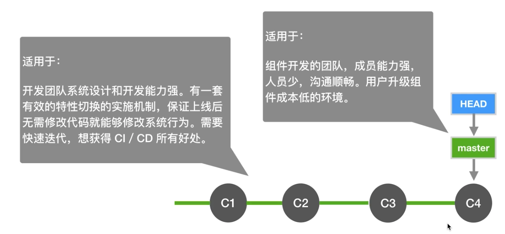
### Git Flow
有特性分支开发 - 比较繁琐
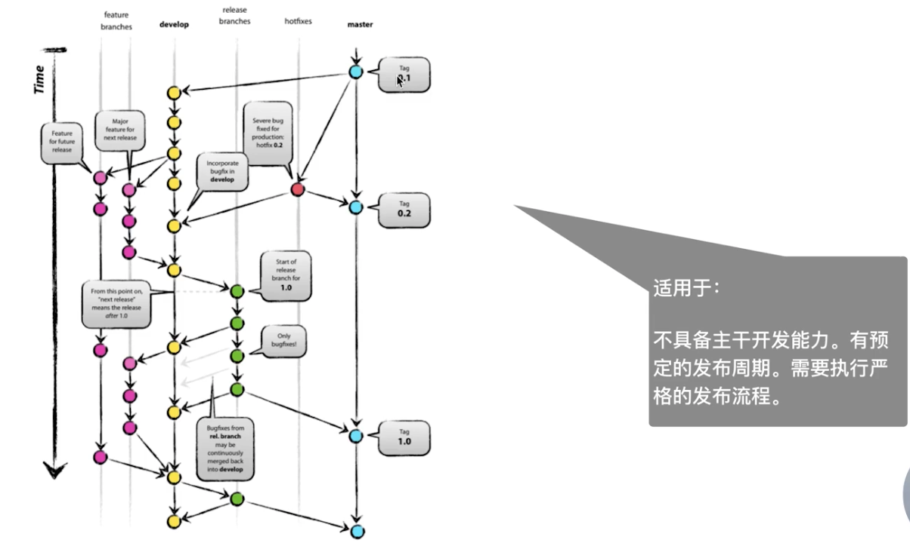
### GitHub Flow
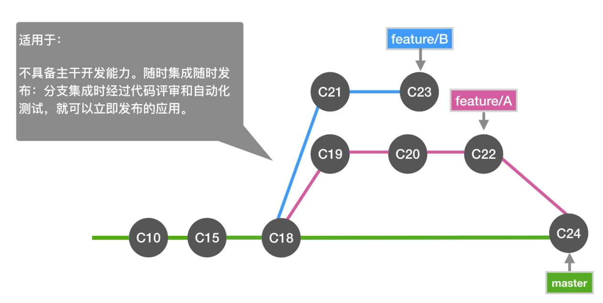
### GitLab Flow
有生产分支
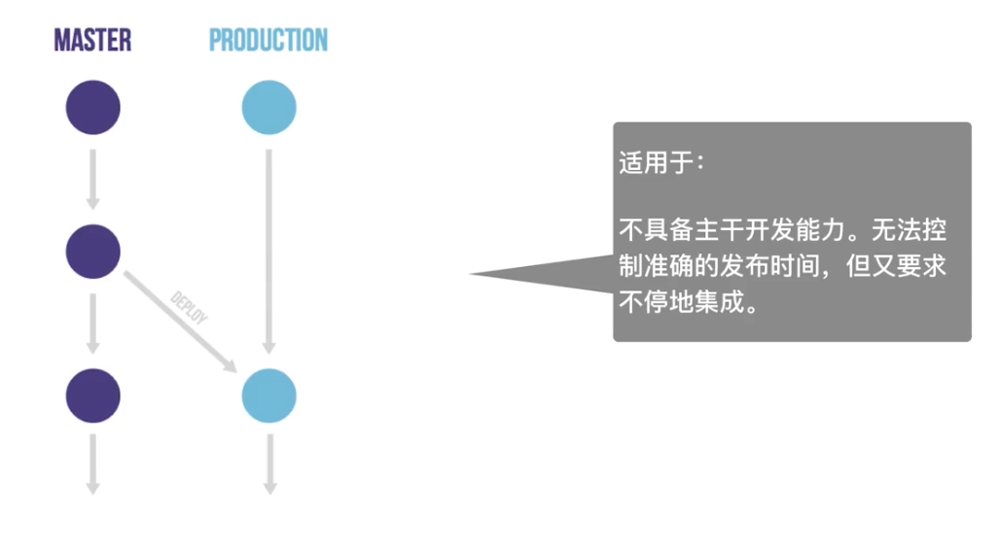

有环境分支
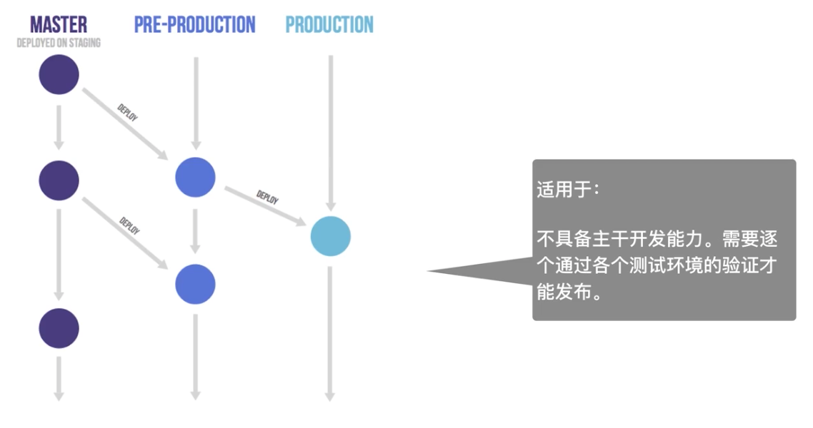

有多个发布分支
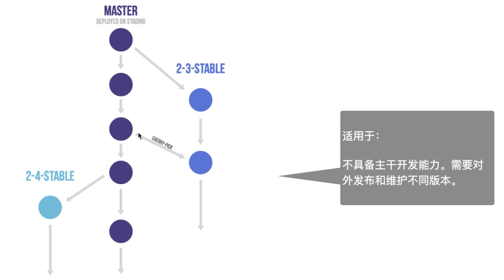
## 分支集成策略
[参考](https://github.com/GitGarden/git_with_travelling/network)

`settings` > `merge button`

当前分支情况:
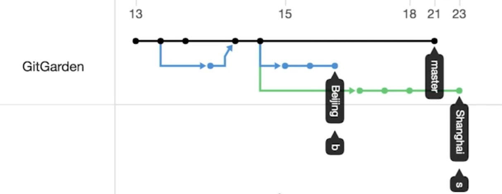
可以在 `insights` -> `network` 中 查看此图

把 `beijing` -合入-> `master` 可以采用**三种方式集成**: 
### `Create a merge commit`
会新生成一个 merge commit
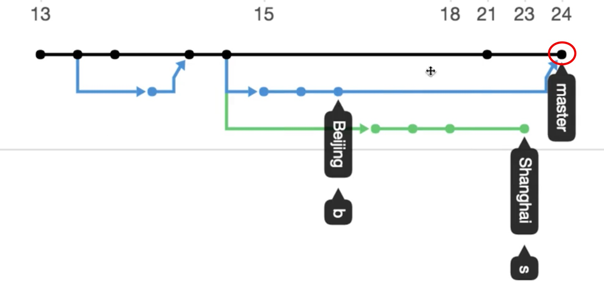
### `Squash and merge`
多个组合成一个 commit 再合并
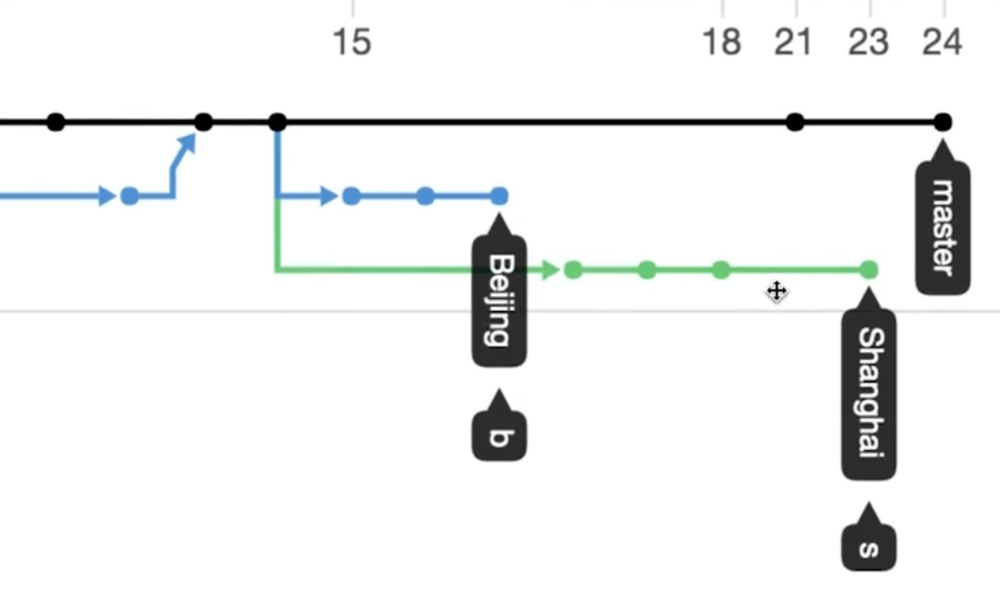
命令行可以通过 `git rebase -i` 交互式的方式达到 squash 的效果
### `Rebase and merge`
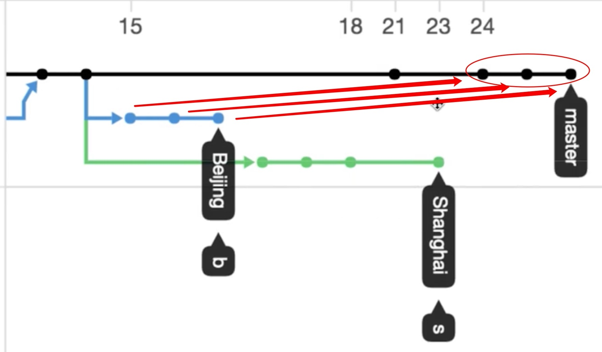

类似依次 `cherry-pick` `beijing`分支的 commit 到 `master`

P.S. 视频中为了演示方便, 直接用 `git push -f` 抹掉了合并记录重新演示
## issue 跟踪需求和任务
参考: [vuejs-issue](https://github.com/vuejs/vue/issues)

- `issue` 通过 label 标签管理
- `issue` open 和 closed 状态
- `issue` 可以关联某个 `project`
- `issue` 可以基于模板创建
- 模板在 `.github/xx.md` 中, [举例](https://github.com/vuejs/vue/blob/dev/.github/PULL_REQUEST_TEMPLATE.md)
## project 管理 issue
`project` 可以启用 `kanban` 看板法 (日)

[演示](https://github.com/GitGarden/git_with_travelling/projects/1)
## code review
如果某些`集成分支`需要 `review` 后才能合并需要到 `settings` -> `branch` 中设置
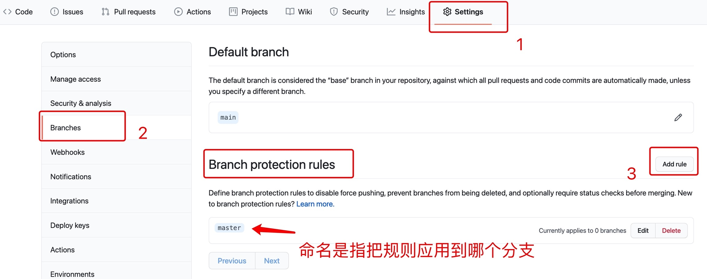

- 创建好 `pull request` 后, 需指定 `code review` 的人员
- `reviewer` 会收到邮件提示
## 多分支的集成

### `Create a merge commit` 策略
- merge `beijing` -> `master`
- merge `shanghai` -> `master` ( conflict )
  - Merge branch `master` into `shanghai`
  - 在 `shanghai` 分支解决冲突
  - `shanghai` 分支会多一个解决冲突的 merge 分支
  - 然后再把 merge `shanghai` -> `master`
  - github 总是使用 `git merge --no-ff` 而不是 git merge ，记录下分支的变更历史
  - `no-ff` 是 no-fast-forwards, 即合并都会生成新 commit

### `Squash and merge` 策略
### `Rebase and merge` 策略
[视频](https://time.geekbang.org/course/detail/100021601-76379)

这个产生冲突后github 不能直接解决, 需要在本地 rebase 解决
#### 方式一 rebase
解决冲突的过程, 有几个 commit 就需要几次
```bash
# shanghai 分支 变基 到 master
git rebase origin/master

# 报冲突, 解决  (一个 commit)
vi readme
git add readme
git rebase --continue

# 报冲突, 解决  (一个 commit)
vi readme
git add readme
git rebase --continue

# 报冲突, 解决  (一个 commit)
vi readme
git add readme
git rebase --continue

gitk --all

# ?? 必须使用 -f
git push -f origin shanghai 

# 在 github 网页点击 rebase and merge
# 发现 把 shanghai 的commit 再 一个个的 cherry-pick 到 master 分支
# 会有 author 和 committer 不一致的情况
```

#### Git 工具 - Rerere
[参考](https://git-scm.com/book/zh/v2/Git-%E5%B7%A5%E5%85%B7-Rerere): 重用记录的解决方案（reuse recorded resolution）
## 如何保证集成质量
[TODO](https://time.geekbang.org/course/detail/100021601-76380) 
## 产品包发布到 github
`release` Tab
## 写项目指导文档